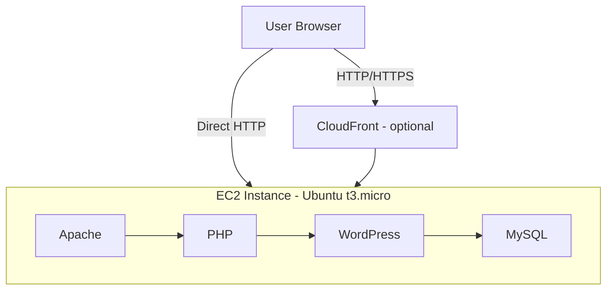

# Architecture Diagram

Here's how the pieces of the SME-DIMZ WordPress project fit together.

A user visits the site either directly through the EC2 public IP, or through CloudFront if that's enabled. Inside the EC2 instance, Apache receives the request and hands it to PHP, which runs WordPress, which talks to MySQL for the actual content and settings.

Everything is running on one EC2 instance to keep things simple and cheap, which fits the SME use case this project is built around. If the site grew and needed to handle more traffic, the next step would usually be moving the database onto RDS and adding a load balancer with more than one server, but that's outside the scope of this project.
